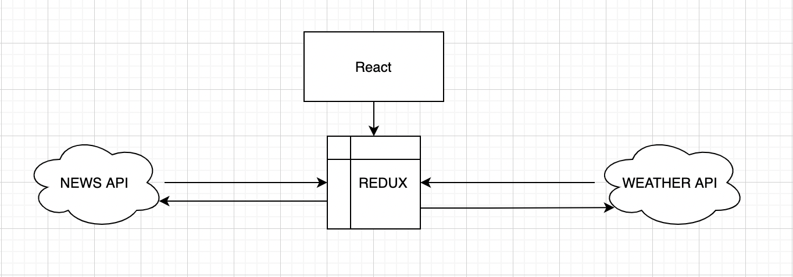
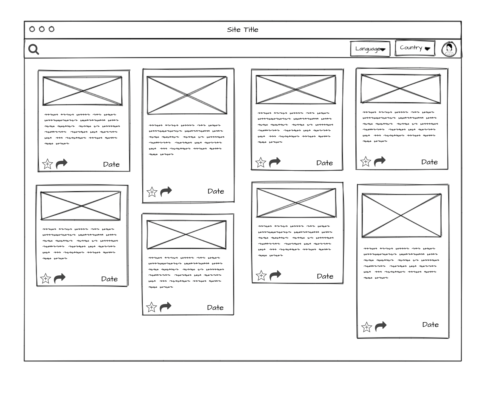
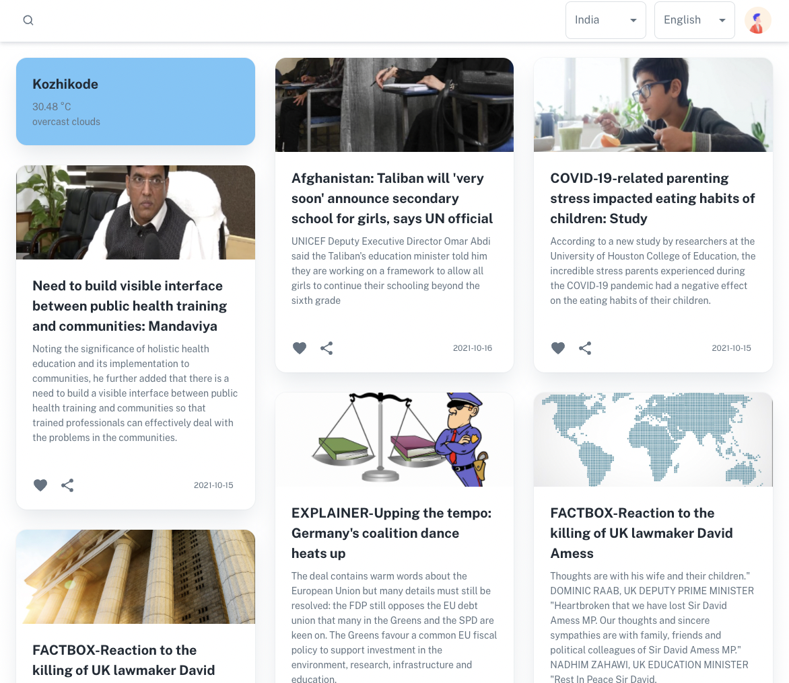
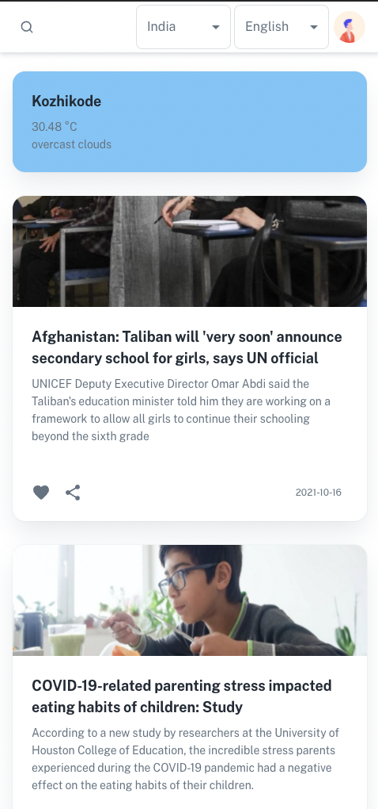

<p align="center">
  <h3 align="center">Weather and News App React/Redux</h3>

</p>


<!-- TABLE OF CONTENTS -->

  <summary><h2 style="display: inline-block">Table of Contents</h2></summary>
  <ol>
    <li>
      <a href="#about-the-project">About The Project</a>
      <ul>
        <li><a href="#built-with">Built With</a></li>
      </ul>
      <ul>
        <li><a href="#wire-frame">Wire Frame</a></li>
      </ul>
      <ul>
        <li><a href="#final-product">Final Product</a></li>
      </ul>
    </li>
    <li>
      <a href="#getting-started">Getting Started</a>
      <ul>
        <li><a href="#prerequisites">Prerequisites</a></li>
        <li><a href="#installation">Installation</a></li>
      </ul>
    </li>
    <li><a href="#roadmap">Roadmap</a></li>
    <li><a href="#license">License</a></li>
    <li><a href="#contact">Contact</a></li>
    <li><a href="#acknowledgements">Acknowledgements</a></li>
  </ol>


<!-- ABOUT THE PROJECT -->
## About The Project

 
 
A simple project which fetches data from Weather and News APIs.


### Built With

* [React](https://reactjs.org/)
* [Redux](https://redux.js.org/)
* [mui](https://mui.com/)
* [gnews.io](https://gnews.io/)
* [openweathermap.org](https://openweathermap.org/)

### Wire Frame

  
  
  
  
### Final Product

  
  
  


<!-- GETTING STARTED -->
## Getting Started

To get a local copy up and running follow these simple steps.

### Prerequisites

  Create .env file with env variables
   ```sh
   REACT_APP_NEWS_API_TOKEN = value1
   REACT_APP_WEATHER_API_TOKEN = value2
   ```
   
### Installation

1. Clone the repo
   ```sh
   https://github.com/abhey-sujith/news_and-_weather.git
   ```
2. Run command 
   ```sh
   npm i
   npm start
   ```
   
   Localhost url :- [http://localhost:3000/dashboard/app](http://localhost:3000/dashboard/app)
   
   Example api after deploying :- [TODO](TODO)

<!-- ROADMAP -->
## Roadmap

✅ Setup project

✅ Setup Redux

✅ Test API with postman

✅ Create UI

✅ Connect with News API

✅ Implement Search , Query with language and country 

✅ Connect with Weather API

✅ Deploy to Heroku


Improvements

☑️ Add Dark Mode.

<!-- LICENSE -->
## License

Distributed under the MIT License. See `LICENSE` for more information.


<!-- CONTACT -->
## Contact

Abhey Sujith  - abheysujith@gmail.com


<!-- ACKNOWLEDGEMENTS -->
## Acknowledgements

* https://www.youtube.com/watch?v=0KEpWHtG10M
* https://material-ui.com/store/items/minimal-dashboard-free/
